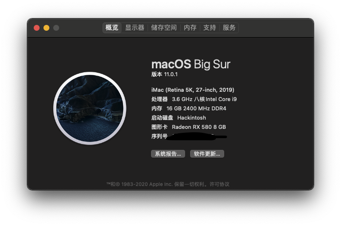

# 个人黑苹果EFI配置

使用此EFI的同学需要有一定的动手能力

## 配置
  
|   |  型号 |
| ------------ | ------------ |
| 主板 | Gigabyte Z390 gaming X  |
| CPU |  I7-9700K |
| 显卡  |   RX580/UHD 630  |
| 内存  |  16GB 2666MHz DDR4 X 1 |
| 存储 | 500G机械硬盘  |
| 网卡 | BCM943602CS |

## 截图

## 系统安装版本
macOS Mojave 10.14.6

## BIOS版本
- F7

## 是否正常工作
- 声卡正常工作
- 无线网卡免驱
- 蓝牙正常，支持Airdrop
- 睡眠正常
- 显卡正常
- USB正常
- 硬解正常

## 已知问题
- 睡眠时间过久，重新唤醒，蓝牙无法使用（蓝牙内建可解决此问题，具体实现方案可搜索，个人的就不贴上来了）

## 其他
由于我手动加了一块RX580，所以默认配置为独显启动，如果核显使用此配置可能不工作，此时使用config_uhd630.plist 的配置
