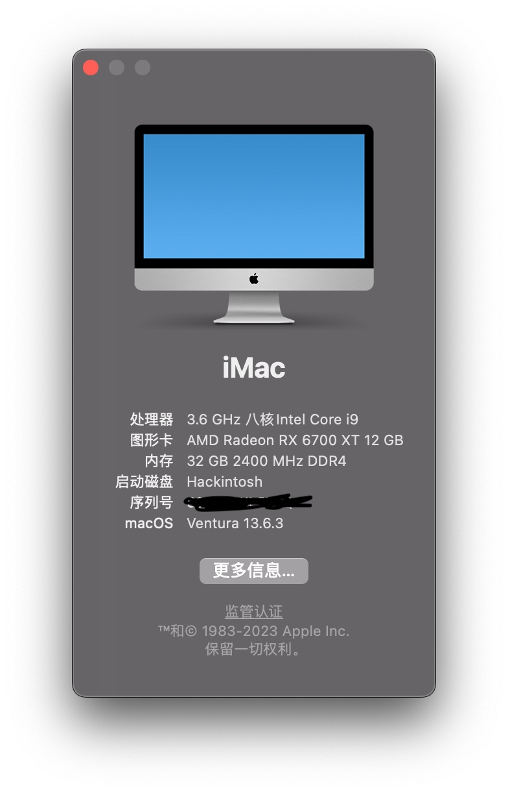

# 个人黑苹果EFI配置(AMD 6700XT)

**OPENCORE版本**:0.9.7

## 注意点

因为我有一个三星的PM981,所以在SSDT里使用**SSDT-DNVME.aml**屏蔽了这个m2接口,如果没有PM981,可以去掉这个SSDT,否则会有一个m2接口不识别

## 配置
  
|   |  型号 |
| ------------ | ------------ |
| 主板 | Gigabyte Z390 gaming X  |
| CPU |  I7-9700K |
| 显卡  |   **AMD RX 6700XT**  |
| 内存  |  32GB 2666MHz DDR4 X 2 |
| 存储 | 256G固态  |
| 网卡 | BCM943602CS |

## 截图

## 系统安装版本

macOS Sonoma 14.3.1

## BIOS版本

- F10

## 是否正常工作

- 声卡正常工作
- 蓝牙正常，支持Airdrop
- 睡眠正常
- 显卡正常(注意显卡为6700xt,使用的是NootRX)
- USB正常
- 硬解正常

## TODO

- CPU型号正确展示
- WIFI 异常
